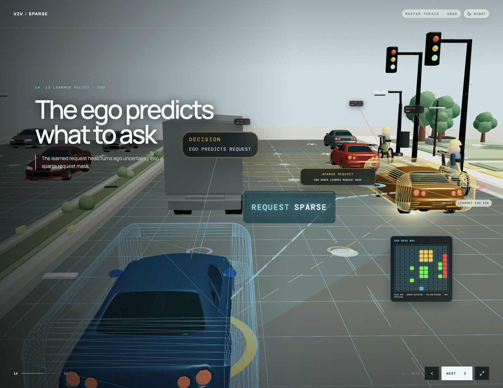

# Receiver-Driven Sparse V2V — 3D Thesis Presentation

Interactive browser-based 3D thesis presentation for receiver-driven sparse V2V communication in cooperative autonomous-driving perception.

The presentation explains the motivation, BEV intermediate fusion, communication baselines, temporal cache, learned temporal receiver control, danger-aware metrics, trajectory-aware metrics, and final results through a guided React Three Fiber scene.



## Overview

This project is a polished thesis/demo presentation rather than a static slide deck. It uses a single interactive urban road scene and moves the camera through the thesis story:

- why vehicle-to-vehicle collaboration helps under occlusion;
- what is communicated at the BEV intermediate-fusion level;
- full communication, sender-side Top-K, snapshot receiver request, temporal cache, and learned temporal receiver-control methods;
- static and trajectory-aware evaluation metrics;
- CARLA and Culver City result summaries;
- implementation/configuration takeaway.

## Tech stack

- React + Vite
- React Three Fiber
- Drei
- Three.js
- GSAP
- CSS glassmorphism UI overlays

## Run locally

```bash
npm install
npm run dev
```

Open the URL printed by Vite, usually:

```text
http://localhost:5173
```

## Build

```bash
npm run build
```

To preview the production build:

```bash
npm run preview
```

## Controls

- `Next` / `Previous` buttons move through the presentation.
- Left and right arrow keys navigate scenes.
- The fullscreen button enters presentation mode.
- The day/night toggle changes the scene lighting theme.

## Project structure

```text
src/
  App.jsx
  main.jsx
  data/
    steps.js                    # scene order, text, camera targets, cards
  components/
    RoadScene.jsx               # main 3D environment and per-scene visuals
    EvidenceOverlay.jsx         # floating cards, tables, figure panels
    CameraController.jsx        # smooth scene camera transitions
    FloatingUIPanel.jsx         # 3D UI panel elements
    scene/                      # modular road actors, buildings, vehicles, props
  config/
    scene.js                    # scene-level constants
  polish.css                    # presentation UI styling
  styles.css                    # base app styling

public/
  models/                       # lightweight vehicle/person assets
  thesis/figures/               # thesis figures used in evidence cards
```

## Key editing points

- Change scene text, slide order, camera positions, and evidence-card data in `src/data/steps.js`.
- Change object placement, markers, animated BEV maps, communication lines, and urban scene details in `src/components/RoadScene.jsx`.
- Change the visual design of cards, tables, and overlays in `src/polish.css`.
- Reusable 3D objects live under `src/components/scene/`.

## Third-party notices

See [THIRD_PARTY_NOTICES.md](THIRD_PARTY_NOTICES.md) for asset and inspiration notes.
